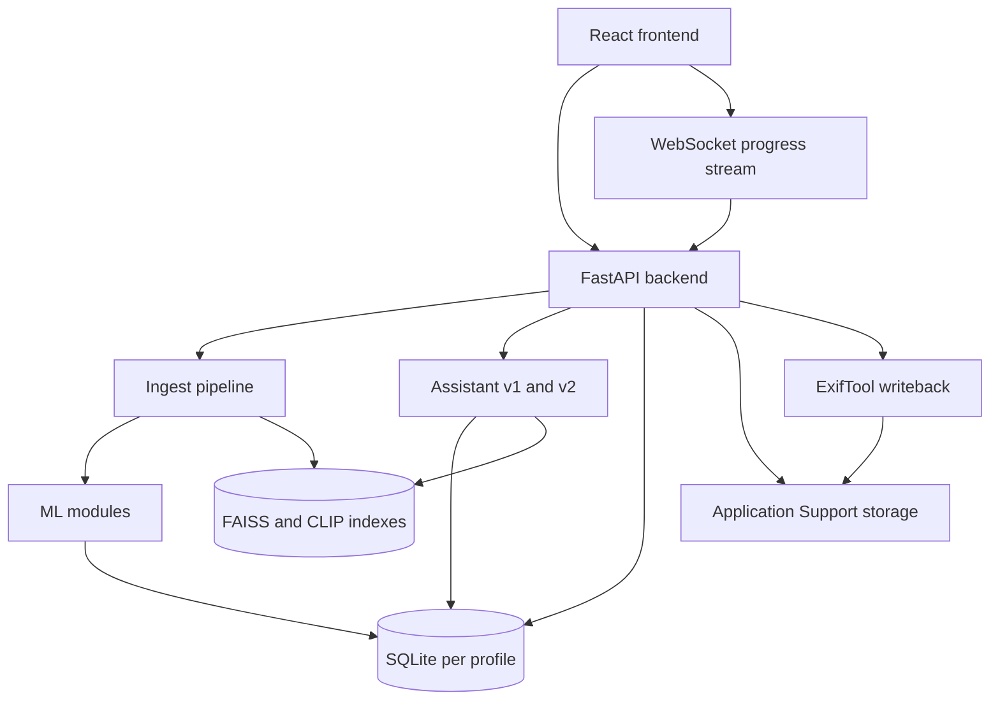

# Visual Intelligence Platform (VIP)

VIP is a local-first photo intelligence application for large personal media libraries. It helps users ingest folders of RAW and image files, detect and organize people, enrich photos with AI-generated understanding, search the library in natural language, and write curated metadata back into source files without sending photo content to a cloud service.

The application is optimized for Apple Silicon Macs and combines a FastAPI backend, a React frontend, SQLite-based profile storage, and an on-device ML pipeline for faces, tags, captions, OCR, retrieval, and metadata writeback.

## Customer Value Proposition

VIP is built for users who have large, messy photo libraries and need practical control over them.

- Find important photos faster using people, place, object, OCR, caption, and natural-language search.
- Turn unstructured image libraries into searchable, labeled assets without giving files to a cloud provider.
- Recover order from historical photo archives by clustering unnamed faces and restoring prior VIP identity history when available.
- Review quality issues, explicit-content detections, and merge suggestions in one local workflow.
- Keep value in the original files through metadata writeback, instead of locking intelligence inside one app database.
- Manage separate libraries safely with profile-scoped storage and settings.

## AI Usage Details

VIP uses AI as a retrieval and enrichment layer across the ingest pipeline and the assistant features.

### Vision and media understanding

- Face detection and embeddings use InsightFace models, with embeddings stored for clustering and identity operations.
- Face clustering uses HDBSCAN-style clustering logic plus coherence thresholds and merge suggestion logic.
- Object detection uses YOLO models.
- Scene, landmark, species, and geospatial enrichment are produced by dedicated model modules in the ML layer.
- Optional Florence-2 support adds generated captions, OCR text, and region text. These outputs are stored in `media_tags` and surfaced through SQL views for downstream retrieval.
- Explicit-content detection runs locally through NudeNet-based inference.
- Quality checks surface blur, closed-eye, and related review signals.

### Search and assistant intelligence

- Traditional API search exists alongside natural-language search and assistant-driven retrieval.
- Assistant v1 provides planner/executor behavior around photo queries.
- Assistant v2 adds tool-based orchestration with routing between deterministic tools, SQL generation, legacy assistant fallback, and hybrid retrieval.
- The retrieval broker can combine multiple branches such as natural search, metadata text, OCR lookup, and face lookup.
- Text-heavy queries are now handled more effectively through Florence-aware SQL surfaces such as `v_photo_text_flat` and `v_photo_text_agg`.
- Ollama is used as the local LLM runtime for assistant planning and tool selection.

### Privacy and runtime model

- The product is designed for local operation.
- Photo intelligence, embeddings, clustering, retrieval indexes, and assistant state are stored on the machine.
- Reverse geocoding and model downloads may depend on external services or package/model sources, but the core media analysis workflow is intended to run locally once dependencies are present.

## Features List

### Library and ingest

- Scan folders recursively and register supported RAW and image formats.
- Maintain profile-scoped libraries, settings, and indexes.
- Re-scan the whole library or targeted folders/subfolders.
- Support import mode that can reuse existing VIP history during scan.
- Track progress over WebSocket events during long-running pipeline operations.

### People and identity

- Detect faces and build unnamed clusters automatically.
- Name people from clusters, merge persons, add clusters to people, or eject misassigned faces.
- Ignore clusters or ignored-person suggestions to keep noise out of the review flow.
- Restore prior VIP identity history during ingest when available.
- Show co-occurrence data through a connections graph.
- Open shared photos by clicking connections between faces in the graph.
- Surface merge suggestions and person-specific face galleries.

### Search, discovery, and review

- Natural-language photo search from the main search entry points.
- Assistant v1 and Assistant v2 chat experiences for guided retrieval.
- Retrieval across persons, tags, OCR text, captions, and other structured signals.
- Discover views for categories such as animals, places, and things.
- Tag summaries and tag-based exploration.
- Quality review flows for blurry or problematic photos.
- Explicit-content review flows.
- Analysis endpoints and rebuild/amendment support for per-photo analysis artifacts.

### Metadata and operations

- Preview writeback changes before applying them.
- Run bulk or single-item metadata writeback.
- Track writeback status and retry failures.
- Remove folders or media from the app without necessarily deleting original files.
- Configure remote writeback servers and test SSH, ExifTool, and path access.
- Manage profiles including create, select, rename, delete, and password operations.
- Tune runtime settings through API-backed persistent settings.

## Architecture

VIP uses a local client/server architecture with profile-scoped runtime storage.



### Frontend

- Single React application in `frontend/src/App.tsx`.
- Section-based navigation for Library, People, Discover, Search, Assistant, Assistant V2, Tags, Writeback, Quality, Explicit, and Admin surfaces.
- Typed API client in `frontend/src/api/client.ts`.
- WebSocket listeners for pipeline progress and review-related events.

### Backend

- FastAPI entrypoint in `backend/main.py`.
- Route modules under `backend/api/routes` for media, persons, faces, search, chat, pipeline, settings, writeback, folders, tags, analysis, remote, admin, and profiles.
- Startup initializes directories, profiles, database migrations, logging, and dependency bootstrap behavior.
- Runtime logs are written to `~/Library/Logs/VIP/vip.log`.

### Storage model

- Profile-scoped runtime data lives under `~/Library/Application Support/VIP/profiles/<profile_id>/`.
- Core state is stored in SQLite.
- Thumbnails, previews, and other generated assets live beside the database in profile storage.
- Vector indexes are maintained separately from the main database.
- Migrations live in `backend/database/migrations/` and evolve the schema incrementally.

### Pipeline outline

The ingest pipeline in `backend/pipeline/ingest.py` is the main long-running workflow.

1. Scan media and extract file/exif context.
2. Generate previews and face detections.
3. Build embeddings, clusters, centroids, and co-occurrence information.
4. Restore prior VIP history when configured.
5. Run taggers, quality checks, explicit detection, CLIP indexing, and optional Florence enrichment.
6. Build analysis outputs and prepare metadata for writeback.

### Assistant architecture

- `backend/assistant/` contains the original planner/executor flow.
- `backend/assistant_v2/` contains the newer orchestration stack.
- Assistant v2 combines a tool planner, registry, orchestrator, SQL agent, and retrieval broker.
- Florence-generated text is queryable through dedicated SQL views that feed both SQL-agent behavior and hybrid retrieval.
- Ollama provides the local LLM serving layer for planner and routing decisions.

## Code Standards

This repository already reflects a few concrete implementation standards. The README should document them because they affect how contributors extend the app.

### General standards

- Keep changes local and minimal; prefer extending the owning abstraction instead of layering duplicate logic.
- Treat SQLite schema changes as migrations in `backend/database/migrations/`.
- Keep runtime state out of the repository; application data belongs under the profile support directories.
- Preserve the typed API boundary between frontend and backend.
- Prefer explicit, reviewable settings over hidden constants; app-wide configuration belongs in `backend/config.py` or the persistent settings store.

### Frontend standards

- Use TypeScript for application code.
- Use the typed client in `frontend/src/api/client.ts` instead of ad hoc fetch logic.
- Keep page-level behavior in `frontend/src/pages/` and reusable UI in `frontend/src/components/`.
- Follow the existing ESLint configuration in `frontend/eslint.config.js`.
- Keep UI changes aligned with the established local-app workflow rather than introducing separate app shells or state systems.

### Backend standards

- Keep route behavior in the route modules and domain logic in the corresponding pipeline, ML, writeback, assistant, or database layers.
- Prefer profile-aware operations for any stateful work.
- Maintain backwards-safe, additive migrations when evolving schema or query surfaces.
- Keep assistant/tool outputs grounded in the existing database and retrieval surfaces.
- Validate changes with focused checks such as TypeScript compile, Python compile, or route-level smoke tests when possible.

## Quick Start

### Prerequisites

- macOS on Apple Silicon.
- Python 3.11.
- Node.js 18 or newer.
- Homebrew.

### Setup

```bash
git clone https://github.com/sifaralways/VisualIntelligencePlatform.git
cd VisualIntelligencePlatform
./setup.sh
```

The setup script installs system dependencies, creates a virtual environment, installs Python packages, installs frontend dependencies, and initializes the database.

### Run

```bash
./start.sh
```

Default local endpoints:

- Frontend: `http://localhost:5173`
- Backend API: `http://localhost:7474`
- FastAPI docs: `http://localhost:7474/docs`

## Tech Stack

| Layer | Current implementation |
| --- | --- |
| Frontend | React 19, TypeScript, Vite, Tailwind CSS 4 |
| Backend | Python 3.11, FastAPI, uvicorn |
| Database | SQLite via aiosqlite |
| Vector retrieval | FAISS |
| Face pipeline | InsightFace, ONNX Runtime |
| Detection and tagging | Ultralytics YOLO, Torch, torchvision |
| Multimodal text enrichment | Florence-2 via transformers |
| CLIP-style retrieval | open-clip-torch |
| Explicit review | NudeNet |
| Geo enrichment | geopy / Nominatim |
| Local LLM runtime | Ollama |

## Key Runtime Paths

- Repo source: this checkout
- Profile data root: `~/Library/Application Support/VIP/profiles/`
- Logs: `~/Library/Logs/VIP/vip.log`

## Key API Areas

- `/api/pipeline` for scan, rescan, reprocess, and status operations.
- `/api/media` for library media listing, filtering, previews, thumbnails, quality, and removal operations.
- `/api/persons` for people, clusters, ignored flows, merge operations, co-occurrence graph, and shared-media retrieval.
- `/api/search` for search and natural search.
- `/api/chat` for assistant v1 and assistant v2 endpoints.
- `/api/writeback` for preview, confirm, single-item writeback, status, and retry.
- `/api/settings` for persisted application settings.
- `/api/remote` for remote writeback server management and connectivity checks.
- `/api/profiles` for multi-profile lifecycle operations.

## Repository Structure

```text
backend/
  api/routes/          FastAPI route modules
  assistant/           Original assistant flow
  assistant_v2/        Tool-based assistant orchestration
  database/            SQLite access, models, settings, migrations
  ml/                  Model wrappers and retrieval helpers
  pipeline/            Ingest and identity pipeline
  scanner/             File walking, hashing, preview/exif extraction
  writeback/           ExifTool integration and metadata mapping
frontend/
  src/App.tsx          Main application shell
  src/pages/           Top-level user surfaces
  src/components/      Shared UI components
  src/api/client.ts    Typed frontend API client
scripts/               Maintenance, benchmarking, and utility scripts
```

## Configuration Notes

- Core defaults live in `backend/config.py`.
- Environment variables use the `VIP_` prefix.
- Example configurable values include API port, Ollama base URL, model names, Florence enablement, clustering thresholds, and retrieval limits.
- Some settings are also persisted through the settings store and changed at runtime through the API/UI.

## Operational Notes

- Startup can auto-install missing Python dependencies unless disabled with `VIP_AUTO_INSTALL_DEPS=0`.
- The backend mounts local thumbnail and preview assets for the UI.
- The app assumes a trusted local environment and does not present itself as a hardened multi-user service.
- Remote writeback exists, but it should be treated as an operational convenience inside a trusted environment.

## Limitations and Assumptions

- The project is optimized for Apple Silicon and local execution.
- Model availability, first-run downloads, and performance characteristics depend on the installed environment.
- Some enrichment capabilities such as Florence text depend on optional model/runtime support.
- Reverse geocoding may depend on external network access.

## Additional Documentation

- `SOLUTION_DESIGN.md` contains deeper architectural notes and design decisions.
- `High level BRD.md` captures the higher-level business requirements.
- `frontend/README.md` is still the default Vite scaffold and should not be treated as the authoritative product README.

## License

Non-commercial use only. Review third-party model and dependency licenses, especially for bundled or auto-downloaded ML assets such as InsightFace weights.
