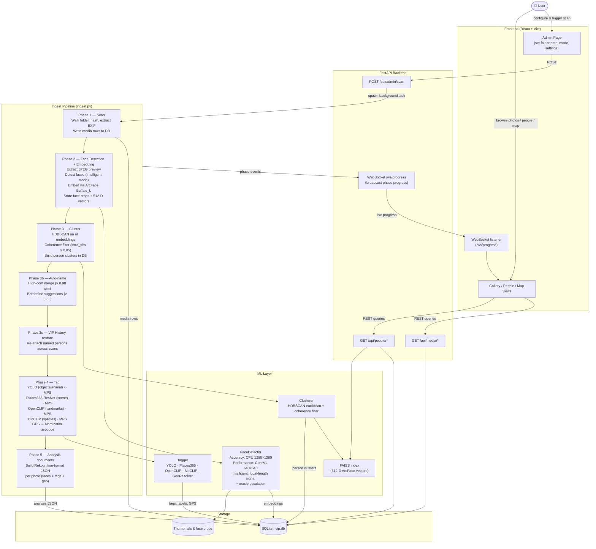

# Visual Intelligence Platform (VIP)

A free, local-first, Apple Silicon-only photo intelligence tool for large RAW photo libraries (50K–100K+ files). No cloud. No subscriptions. Everything runs on-device.

---

## What It Does

- **Scans** your entire photo library recursively — Canon CR3, Sony ARW, Nikon NEF, DNG and more
- **Detects and embeds faces** using InsightFace Buffalo_L (RetinaFace + ArcFace, 512-D embeddings)
- **Clusters faces** into people groups automatically via HDBSCAN
- **Tags photos** with objects, animals, scenes, geography, and places using YOLOv11, Places365, OpenCLIP, and BioCLIP
- **Resolves GPS coordinates** to human-readable place names via Nominatim/OSM
- **Lets you name people** through a browser UI — no ML jargon, just face tiles and name inputs
- **Writes metadata back** into the original RAW files using ExifTool (XMP, IPTC, MWG face regions)
- **Makes files searchable** in macOS Spotlight immediately after writeback

---

## Pipeline Phases

| Phase | What Happens |
|---|---|
| **Phase 1 — Scan** | Walk folders, SHA-256 hash, EXIF extraction, iCloud stub detection |
| **Phase 2 — Embed** | Extract embedded JPEG preview → RetinaFace detect → ArcFace embed |
| **Phase 3 — Cluster** | HDBSCAN groups faces into person clusters |
| **Phase 4 — Tag** | YOLOv11 objects/animals + Places365 scenes + CLIP landmarks + BioCLIP species + Nominatim GPS |
| **Phase 5 — Writeback** | ExifTool writes `PersonInImage`, `Subject`, `Keywords`, `RegionInfo`, `Location` into files |

---

## End-to-End Flow



---

## ML Models Used

| Model | Purpose | Backend |
|---|---|---|
| InsightFace Buffalo_L | Face detection + 512-D embeddings | ONNX (CPU EP) |
| YOLOv11s | Object + animal detection (COCO 80 classes) | ultralytics / MPS |
| Places365 ResNet-50 | Scene/geography classification | PyTorch / MPS |
| OpenCLIP ViT-B/32 | Zero-shot landmark recognition (56 landmarks) | open-clip-torch |
| BioCLIP | Species-level animal classification (150+ species) | open-clip-torch |
| Nominatim / OSM | GPS → human-readable place name | geopy |

All models run **100% locally**. No data leaves your machine.

---

## XMP Fields Written

| Field | Content |
|---|---|
| `XMP:PersonInImage` | Named persons (e.g. `Alice`, `Bob`) |
| `XMP-mwg-rs:Regions` | Face bounding boxes with names (Lightroom / Capture One compatible) |
| `XMP:Subject` / `IPTC:Keywords` | All tags with prefixes: `obj:`, `animal:`, `geo:`, `place:` |
| `XMP:Location` | GPS-resolved place name |
| GPS fields | Preserved as-is from original EXIF |

---

## Requirements

- **macOS** on **Apple Silicon** (M1/M2/M3/M4 series) — not Intel
- Python 3.11+
- Node.js 18+
- ExifTool (`brew install exiftool`)
- ~800MB disk for ML model cache (auto-downloaded on first Phase 4 run)

---

## Quick Start

```bash
# 1. Clone
git clone https://github.com/sifaralways/VisualIntelligencePlatform.git
cd VisualIntelligencePlatform

# 2. Bootstrap (installs deps, creates venv, inits DB)
./setup.sh

# 3. Start
./start.sh
# Backend → http://localhost:7474
# Frontend → http://localhost:5173
```

---

## Tech Stack

| Layer | Tool |
|---|---|
| Backend | Python 3.11 + FastAPI + uvicorn |
| Database | SQLite (aiosqlite), WAL mode, FK constraints |
| Face ML | InsightFace Buffalo_L, ONNX CPU EP |
| Object ML | YOLOv11s (ultralytics), PyTorch MPS |
| Scene ML | Places365 ResNet-50, PyTorch MPS |
| CLIP ML | OpenCLIP ViT-B/32, BioCLIP |
| Geo | geopy / Nominatim (OpenStreetMap) |
| Clustering | HDBSCAN (`hdbscan`) |
| Vector Index | FAISS (flat, 512-D) |
| Metadata write | ExifTool CLI (subprocess, 30s timeout) |
| Frontend | React 18 + Vite 5 + Tailwind CSS v4 |

---

## Repository Structure

```
VisualIntelligencePlatform/
├── backend/
│   ├── main.py                     # FastAPI app entry point
│   ├── config.py                   # All settings (Pydantic)
│   ├── database/
│   │   ├── db.py                   # aiosqlite pool
│   │   ├── models.py               # Pydantic models for DB
│   │   ├── settings_store.py       # App settings persistence
│   │   └── migrations/
│   │       ├── 001_initial.sql     # Core schema (media_files, faces, embeddings, persons, clusters, scan_state, writeback_queue)
│   │       └── 002_tags.sql        # media_tags table
│   ├── scanner/
│   │   ├── walker.py               # Recursive walk, stub detection
│   │   ├── hasher.py               # SHA-256, idempotency check
│   │   ├── exif_reader.py          # ExifTool JSON wrapper
│   │   └── preview_extractor.py    # Embedded JPEG preview extraction
│   ├── ml/
│   │   ├── face_detector.py        # InsightFace RetinaFace (CPUExecutionProvider)
│   │   ├── embedder.py             # ArcFace embedding
│   │   ├── clusterer.py            # HDBSCAN clustering
│   │   ├── object_detector.py      # YOLOv11s
│   │   ├── scene_classifier.py     # Places365
│   │   ├── landmark_recogniser.py  # OpenCLIP zero-shot
│   │   ├── species_classifier.py   # BioCLIP
│   │   ├── geo_resolver.py         # Nominatim/geopy
│   │   ├── tagger.py               # Orchestrates all taggers
│   │   └── index.py                # FAISS index
│   ├── pipeline/
│   │   ├── ingest.py               # Pipeline orchestrator (all phases)
│   │   └── centroid.py             # Person centroid update
│   ├── writeback/
│   │   ├── exiftool.py             # ExifTool subprocess wrapper
│   │   ├── fields.py               # XMP field mapping
│   │   └── engine.py               # Writeback logic
│   └── api/routes/
│       ├── pipeline.py, persons.py, faces.py, media.py, search.py, writeback.py, tags.py, admin.py
├── frontend/src/
│   ├── pages/
│   │   ├── PeoplePage.tsx          # Face tiles, naming, face review, eject
│   │   ├── PipelinePage.tsx        # Scan controls + live progress
│   │   ├── SearchPage.tsx
│   │   ├── WritebackPage.tsx
│   │   └── AdminPage.tsx           # Stats + scoped resets
│   └── api/client.ts               # Typed API client
├── requirements.txt
├── setup.sh
├── start.sh
├── SOLUTION_DESIGN.md              # Full architecture & decisions doc
└── High level BRD.md               # Original business requirements
```

---

## Key API Endpoints

| Method | Endpoint | Description |
|---|---|---|
| `POST` | `/api/pipeline/scan` | Start pipeline (all 4 phases) |
| `GET` | `/api/pipeline/status` | Current pipeline status |
| `WS` | `/ws/progress` | Real-time progress events |
| `GET` | `/api/persons` | All persons with photo counts + representative thumbnail |
| `GET` | `/api/persons/{id}/faces` | All face crops for a person (for review panel) |
| `PATCH` | `/api/persons/{id}` | Set name, merge, split |
| `DELETE` | `/api/faces/{id}/from-person` | Eject a misassigned face from a person |
| `GET` | `/api/media/{id}` | Media file metadata |
| `GET` | `/api/media/{id}/preview` | Serve JPEG preview |
| `GET` | `/api/faces/{id}/thumbnail` | Serve face crop JPEG (200×200) |
| `POST` | `/api/search` | Search query |
| `GET` | `/api/writeback/preview` | Dry-run: list of pending writes + field diffs |
| `POST` | `/api/writeback/confirm` | Execute ExifTool writes |
| `GET` | `/api/writeback/status` | Writeback job status |
| `GET` | `/api/tags/{media_file_id}` | ML tags for a photo, grouped by category |
| `GET` | `/api/tags/summary/top` | Most frequent tags across library (filterable by category) |
| `GET` | `/api/admin/stats` | DB row counts + pipeline state breakdown |
| `POST` | `/api/admin/reset/{scope}` | Scoped reset: faces / clusters / tags / all (FK-safe) |

---

## Logs

```bash
tail -f ~/Library/Logs/VIP/vip.log
```

Rotating log, 10MB × 5 files.

---

## Licence

Non-commercial use only. InsightFace Buffalo_L weights are permitted under non-commercial licence.
